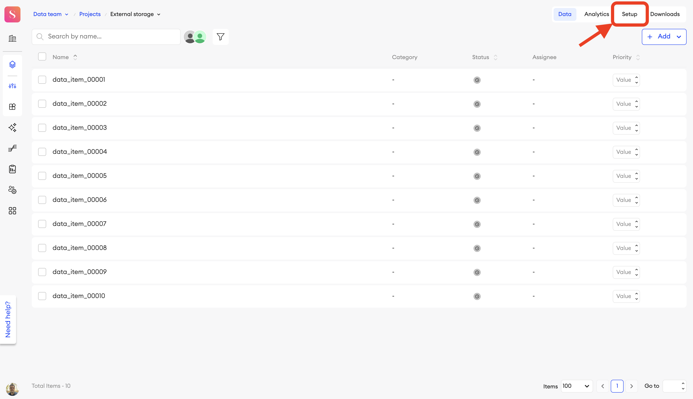
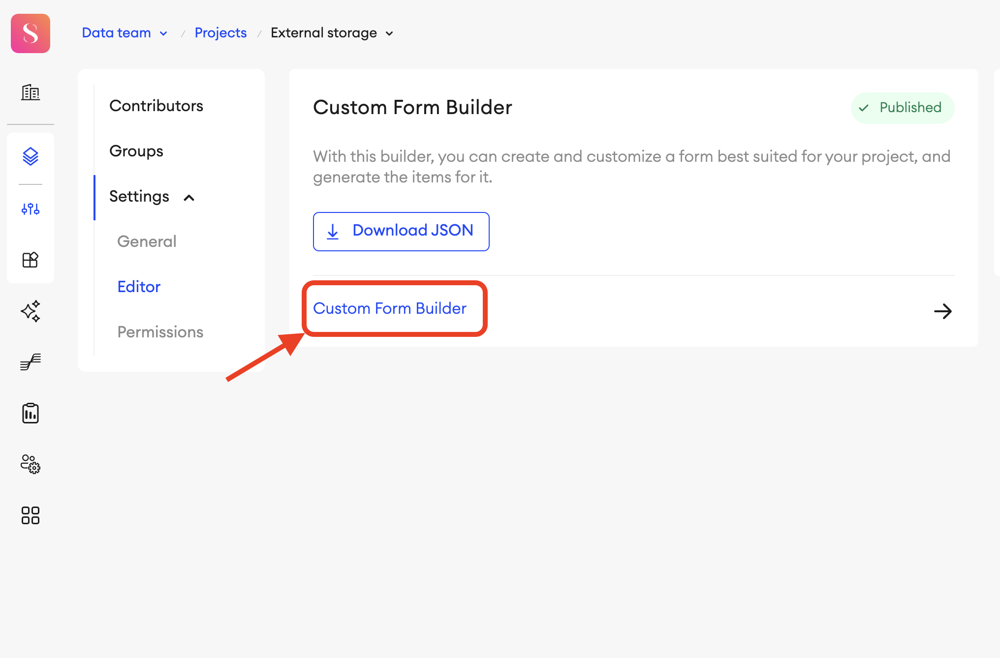
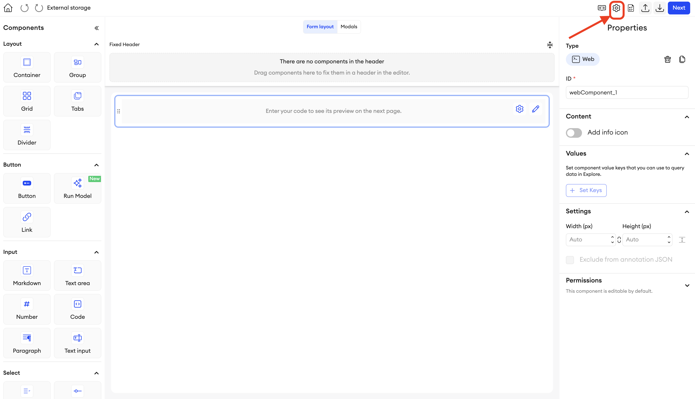
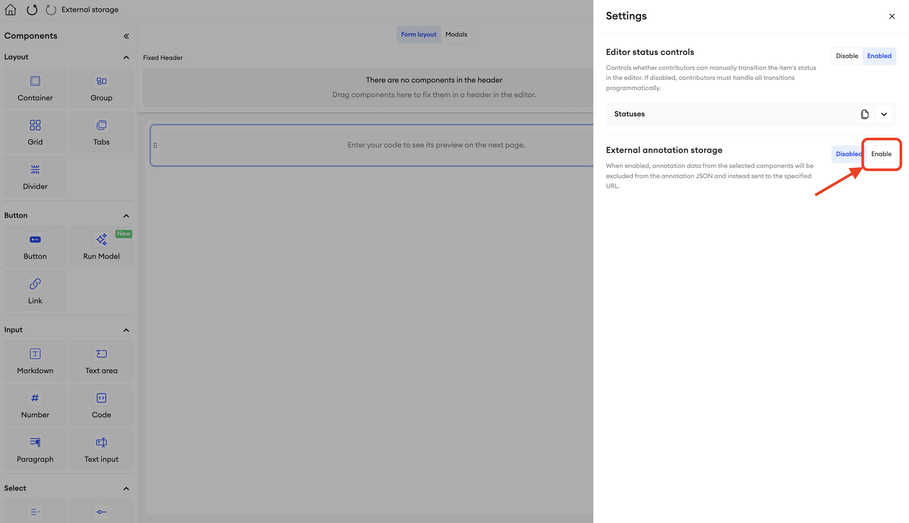
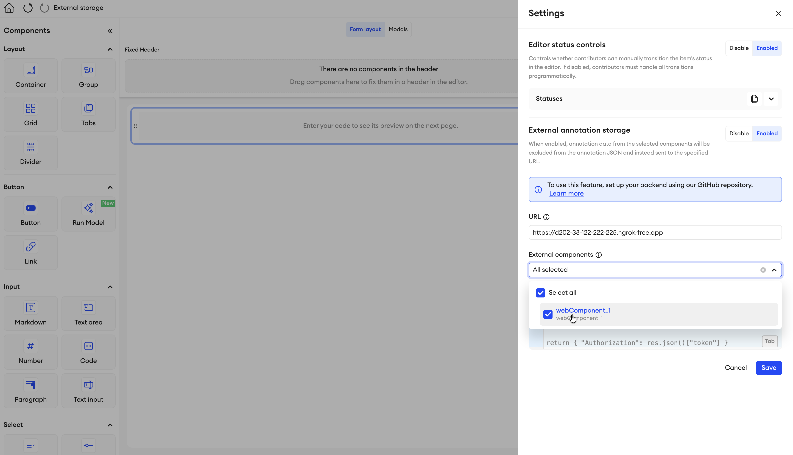

# SuperAnnotate External Data Store

A self-hosted Node.js server that lets you keep SuperAnnotate annotation
data — and optionally the raw assets behind it — on **your own infrastructure**
instead of the SuperAnnotate cloud.

> Looking for architecture, internals, or contribution details? See [docs/DEVELOPER.md](./docs/DEVELOPER.md).

## 1. Introduction

By default, when contributors work in a SuperAnnotate project, the annotation
data they produce is stored in the **SuperAnnotate cloud**. For teams with data
residency, compliance, or privacy requirements, that may not be acceptable.

This package is the **external storage backend** that SuperAnnotate's
*External annotation storage* feature talks to. Once enabled and pointed at a
deployment of this server, SuperAnnotate stops persisting the annotation data of
the **selected components** in its own cloud and instead sends it to your server,
which writes it to a storage backend that **you** control. The same server also
serves the item's raw input assets through short-lived signed download URLs.

It supports two storage backends today:

- **Local disk** (`DATA_STORE=LOCAL`) — store data on the server's own filesystem
  (or any volume/mount it can reach, e.g. on-premises storage).
- **AWS S3** (`DATA_STORE=S3`) — store data in an S3 bucket in your own AWS account.

Storage is **per-component and opt-in**: you choose, in the SuperAnnotate form
builder, exactly which components have their values stored externally on your
side. Any components you don't select keep behaving as usual and remain in the
SuperAnnotate cloud. This lets you externalize only the sensitive data while
leaving the rest untouched.

The trust model is important: **SuperAnnotate remains the authorization
authority.** Every request to this server is verified against SuperAnnotate using
the caller's access token, and the storage location of each item is resolved from
SuperAnnotate — never from client-supplied paths. This server only maps
already-authorized items to storage locations.

## 2. Initial setup

### Prerequisites

- Node.js `>= 20` and npm
- A SuperAnnotate access token (for calling the API)
- For S3 mode: AWS credentials and a bucket

### Installation

```bash
git clone https://github.com/superannotateai/sa-external-data-store.git
cd sa-external-data-store
npm install
```

### Configuration (environment variables)

Configuration is read from environment variables (a local `.env` file is
supported via `dotenv`).

#### Common

| Variable | Required | Default | Description |
| --- | --- | --- | --- |
| `PORT` | No | `3005` | Port the server listens on |
| `NODE_ENV` | In prod | – | Set to `production` in production. Enables fail-fast config and disables dev request logging |
| `DATA_STORE` | Yes | – | Storage backend: `LOCAL` or `S3` |
| `SA_ITEM_API_HOST` | In prod | `item.superannotate.com`* | SuperAnnotate item API host |
| `SA_USER_API_HOST` | In prod | `api.superannotate.com`* | SuperAnnotate user API host |
| `PUBLIC_PROTOCOL` | No | `http` | Protocol used when building signed URLs (`https` behind TLS) |
| `PUBLIC_HOST` | In prod | `localhost:<PORT>`* | Public host[:port] used when building signed URLs |

\* The defaults apply only when `NODE_ENV` is not `production`. In production these
variables are **required** and the server fails to start if they are missing.

#### LOCAL backend (`DATA_STORE=LOCAL`)

| Variable | Required | Description |
| --- | --- | --- |
| `LOCAL_STORAGE_PATH` | Yes | Absolute path to the storage root for this org |
| `LOCAL_SIGN_SECRET_KEY` | Yes | Secret used to sign download URLs. Use a long, random value — never a placeholder |
| `SIGN_URL_EXPIRATION_TIME_HR` | Yes | Signed URL lifetime, in hours |

#### S3 backend (`DATA_STORE=S3`)

| Variable | Required | Description |
| --- | --- | --- |
| `S3_BUCKET_NAME` | Yes | Target bucket |
| `S3_ACCESS_KEY_ID` | Yes | AWS access key ID |
| `S3_SECRET_ACCESS_KEY` | Yes | AWS secret access key |
| `S3_REGION` | Yes | AWS region (e.g. `us-east-1`) |
| `S3_PREFIX` | Yes | Key prefix (e.g. `items`) |

Example `.env` for local development:

```env
PORT=3005
DATA_STORE=LOCAL
LOCAL_STORAGE_PATH=/absolute/path/to/storage
LOCAL_SIGN_SECRET_KEY=replace-with-a-long-random-secret
SIGN_URL_EXPIRATION_TIME_HR=1
PUBLIC_PROTOCOL=http
PUBLIC_HOST=localhost:3005
```

### Running locally

Development (auto-reload):

```bash
npm run dev
```

Production (compile, then run):

```bash
npm run build
npm start
```

Verify it's up:

```bash
curl http://localhost:3005/health
# { "message": "OK" }
```

## 3. Deployment

This package is intentionally shipped as a **plain Node.js/Express server** rather
than a locked-down appliance. Annotation storage requirements differ a lot
between teams, so the goal is to give you the source and let you choose the
deployment model — and customize the code — that best fits your environment.

Whatever option you pick, the deployment must satisfy a few requirements:

- **Publicly reachable over HTTPS** from SuperAnnotate. The configured external
  storage URL must resolve to this server. SuperAnnotate's browser app calls it
  directly, so a valid TLS certificate is required in production.
- **Environment variables set** as described in [section 2](#2-initial-setup),
  including `NODE_ENV=production`, `PUBLIC_PROTOCOL=https`, and the correct
  `PUBLIC_HOST` so signed URLs are generated with the real public address.
- **Storage backend access** — either a persistent volume for `LOCAL` mode or
  AWS credentials/role for `S3` mode.

> CORS is already restricted to `https://*.superannotate.com`, so no extra origin
> configuration is needed for the SuperAnnotate web app to reach the server.

A few common approaches:

### Option A — VM / bare metal with a process manager

Run the compiled server directly on a VM (EC2, GCE, Azure VM, or on-prem host)
and keep it alive with a process manager such as **pm2** or a **systemd** unit.

```bash
npm ci
npm run build
NODE_ENV=production pm2 start dist/index.js --name sa-external-data-store
```

Put it behind a reverse proxy (nginx, Caddy, etc.) that terminates TLS and
forwards to the server's `PORT`. This is the most flexible option if you want to
mount on-prem storage for `LOCAL` mode.

### Option B — Docker container

Containerize the build output and run it anywhere that runs containers (ECS,
Kubernetes, Cloud Run, a plain Docker host). A minimal image:

```dockerfile
FROM node:20-alpine
WORKDIR /app
COPY package*.json ./
RUN npm ci
COPY . .
RUN npm run build
ENV NODE_ENV=production
EXPOSE 3005
CMD ["node", "dist/index.js"]
```

Provide configuration through environment variables, mount a volume for `LOCAL`
storage (or attach an IAM role/credentials for `S3`), and front it with TLS.

### Option C — Platform / serverless-style hosting

Because it's a standard Express app, it also runs on managed Node platforms
(Render, Railway, Fly.io, Elastic Beanstalk, App Service, etc.). These handle TLS
and process supervision for you; just set the environment variables and, for
`LOCAL` mode, confirm the platform offers persistent disk (otherwise prefer `S3`).

Whichever route you choose, note the resulting **base URL** (e.g.
`https://annotations.example.com`) — you'll enter it into SuperAnnotate next.

## 4. SuperAnnotate project setup

Once your server is deployed and reachable, connect it to your SuperAnnotate
project.

### 1. Open project settings

In your project, go to **Setup**.



### 2. Open the Custom Form Builder

Under **Settings → Editor**, open the **Custom Form Builder**.



### 3. Open the form settings

In the form builder, open the **Settings** panel (gear icon, top right).



### 4. Enable external storage

Find **External annotation storage** and switch it to **Enabled**.



### 5. Fill in the configuration

Complete the configuration form and press **Save**:

- **URL** — the deployed server's base URL (e.g. `https://annotations.example.com`).
- **External components** — select, from the menu, the components whose values you
  want stored externally on your side. Unselected components keep their values in
  the SuperAnnotate cloud.
- **Custom headers** (optional) — leave blank.



### 6. Check the connection

After saving, verify the connection — the server must respond with **200**.
This corresponds to the server's `GET /check` endpoint, which validates both the
SuperAnnotate token and storage connectivity. A successful check means
SuperAnnotate will now route the selected components' annotation data to your
server.

---

## Using the API

All endpoints except `/health` require a SuperAnnotate access token. Item-scoped
endpoints also require the team/project/folder/item headers; the service resolves
the actual file location from SuperAnnotate.

| Method | Path | Auth | Description |
| --- | --- | --- | --- |
| GET | `/health` | No | Health check |
| GET | `/check` | Yes | Verifies SuperAnnotate auth + storage connectivity |
| GET | `/annotation/` | Yes | Download the item's annotation file |
| POST | `/annotation/` | Yes | Upload/replace the item's annotation file |
| GET | `/storage/` | Yes | Return signed download URLs for the item's access-map files |
| GET | `/storage/fileSigned` | Signed URL | Download a raw asset via a signed URL |

Required headers for item-scoped endpoints:

- `x-sa-access-token` — SuperAnnotate access token
- `sa-team-id`, `sa-project-id`, `sa-folder-id`, `sa-item-id`

### Examples

Download an annotation:

```bash
curl -X GET "http://localhost:3005/annotation/" \
  -H "x-sa-access-token: <token>" \
  -H "sa-team-id: 1" -H "sa-project-id: 2" \
  -H "sa-folder-id: 3" -H "sa-item-id: 4"
```

Upload an annotation:

```bash
curl -X POST "http://localhost:3005/annotation/" \
  -H "x-sa-access-token: <token>" \
  -H "sa-team-id: 1" -H "sa-project-id: 2" \
  -H "sa-folder-id: 3" -H "sa-item-id: 4" \
  -H "Content-Type: application/octet-stream" \
  --data-binary "@annotation.json"
```

Get signed URLs for an item's files, then download one:

```bash
curl -X GET "http://localhost:3005/storage/" \
  -H "x-sa-access-token: <token>" \
  -H "sa-team-id: 1" -H "sa-project-id: 2" \
  -H "sa-folder-id: 3" -H "sa-item-id: 4"
# -> { "label": "...", "files": { "contract.pdf": "<signed url>" }, "metadata": {} }

curl -L "<signed url>" -o contract.pdf
```

Errors are returned as standardized JSON:

```json
{
  "error": "Unauthorized",
  "message": "Invalid or expired authorization token",
  "code": "AUTH_INVALID_TOKEN",
  "timestamp": "2026-02-26T12:00:00.000Z"
}
```

### Local storage folder structure

When `DATA_STORE=LOCAL`, the service reads and writes everything under a single
storage root.

1. Create the storage folder in the **root of this project** (e.g. `local_storage/`).
2. Point `LOCAL_STORAGE_PATH` at it using an **absolute path**:

   ```env
   LOCAL_STORAGE_PATH=/absolute/path/to/sa-external-data-store/local_storage
   ```

Inside `LOCAL_STORAGE_PATH` there are up to three folders:

```text
{LOCAL_STORAGE_PATH}/
  files/         # input assets (optional)
  access_maps/   # download access rules (optional)
  items/         # annotations (created automatically)
```

> `files/` and `access_maps/` are **optional** — they are only needed when items
> have input assets (images, videos, PDFs, etc.) that should be downloadable.
> A project that only stores annotations needs just `items/` (auto-created).

#### `files/` — input assets

Stores the raw input files served for download. Lay them out however you like;
nested subfolders are allowed (e.g. `files/images/image_1.jpg`). **Symlinks are
supported**, so large datasets can live elsewhere and be linked in.

```text
files/
  contract.pdf
  images/
    image_1.jpg
    image_2.jpg
```

Files are never listed directly — an asset is only downloadable if an access map
references it (see below).

#### `access_maps/` — download access rules

An *access map* is a JSON file that declares which `files/` assets a given item is
allowed to expose. `GET /storage/` reads it and returns a signed download URL for
each listed file.

**Location**

```text
access_maps/<team_id>/<project_id>/<item_name>.json
```

- Scoped by **team and project only** — intentionally independent of the
  SuperAnnotate folder.
- The file name must match the **item name** (without extension), e.g. an item
  named `test_00001` → `access_maps/<team_id>/<project_id>/test_00001.json`.
- Because the path has no folder component, **items with the same name share the
  same access rule**, even if they live in different SuperAnnotate folders.

**File format**

```json
{
  "label": "test_00001",
  "files": ["images/image_1.jpg"],
  "metadata": {}
}
```

- `label` — human-readable label (free-form).
- `files` — the **allowlist**: relative paths under `files/`. Only files listed
  here can ever be signed/downloaded for this item. Nested paths are allowed
  (e.g. `images/image_1.jpg`); `..`, absolute paths, and control characters are rejected.
- `metadata` — arbitrary JSON, returned as-is to the caller.

**Access logic (how a download is authorized)**

1. The caller hits `GET /storage/` with their SA token and `sa-team-id`,
   `sa-project-id`, `sa-folder-id`, `sa-item-id`.
2. The service resolves the item from SuperAnnotate (`getItem`) — this is the
   authorization check and also yields the item **name**.
3. It reads `access_maps/<team_id>/<project_id>/<item_name>.json`.
4. For each entry in `files`, it returns a short-lived signed URL pointing at
   `GET /storage/fileSigned`.
5. `404 NOT_FOUND_MANIFEST` is returned if no access map exists for the item.

#### `items/` — annotations (auto-managed)

Annotation files are created and updated automatically by the service; you do not
create these by hand.

**Storage path**

```text
items/<team_id>/<project_id>/<folder_id>/<item_name>_annotation.json
```

- Folder-scoped (unlike access maps), because annotations belong to a specific
  SuperAnnotate folder/item.
- `<item_name>` is resolved from SuperAnnotate; the file name is always
  `<item_name>_annotation.json`.
- `POST /annotation/` writes this file (creating parent folders as needed);
  `GET /annotation/` reads it.

#### Example: 3 image items

A minimal setup for team `1`, project `2`, with three items
(`test_00001`–`test_00003`), each exposing one image:

```text
local_storage/
  files/
    images/
      image_1.jpg
      image_2.jpg
      image_3.jpg
  access_maps/
    1/
      2/
        test_00001.json
        test_00002.json
        test_00003.json
  items/                         # created automatically after annotations are saved
    1/2/<folder_id>/
      test_00001_annotation.json
```

Each access map points one item at one image — e.g. `access_maps/1/2/test_00001.json`:

```json
{
  "label": "test_00001",
  "files": ["images/image_1.jpg"],
  "metadata": {}
}
```

`test_00002.json` → `images/image_2.jpg`, `test_00003.json` → `images/image_3.jpg`.

Calling `GET /storage/` for item `test_00001` then returns:

```json
{
  "label": "test_00001",
  "files": {
    "images/image_1.jpg": "https://<host>/storage/fileSigned?path=images%2Fimage_1.jpg&expires=...&signature=..."
  },
  "metadata": {}
}
```

##### Upload manifest (JSONL)

To create the matching items in SuperAnnotate, use a JSONL upload manifest — one
JSON object per line. The `metadata.name` of each line must match the access-map
file name (the item name). This file is consumed by SuperAnnotate's import, not by
this service.

`upload_1.jsonl`:

```jsonl
{"metadata":{"name":"test_00001","folder_name":"batch_1"},"data":{"image_annotation":{"value":{"name":"test_00001"}}}}
{"metadata":{"name":"test_00002","folder_name":"batch_1"},"data":{"image_annotation":{"value":{"name":"test_00002"}}}}
{"metadata":{"name":"test_00003","folder_name":"batch_1"},"data":{"image_annotation":{"value":{"name":"test_00003"}}}}
```

- `metadata.name` — item name; must match the access-map file name (`<item_name>.json`).
- `metadata.folder_name` — target SuperAnnotate folder (e.g. `batch_1`).
- `data.<component_id>.value` — initial component value (here component `image_annotation`).

## Testing

```bash
npm test            # run unit tests
npm run test:coverage
```

## License

ISC
